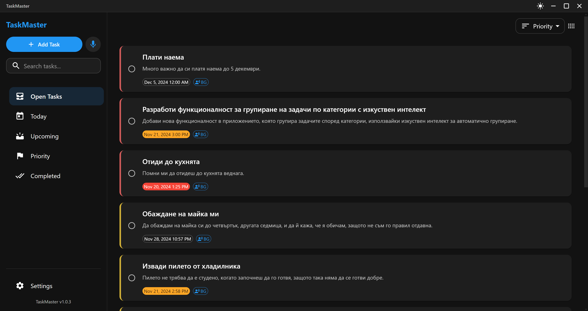

# TaskMaster - Modern Task Management Application

A beautiful and responsive task management application built with Electron and React. TaskMaster helps you organize your work and life with a clean, modern interface and powerful features.



## Features

- Create, edit, and delete tasks
- Set due dates and priorities
- Organize tasks with categories
- Search and filter tasks
- Dark/light mode support
- Beautiful, modern UI with animations
- Local data persistence
- Responsive design
- Fast and efficient
- Auto-updates support

## Installation

### For Users

1. Download the latest installer from the [Releases](../../releases) page
2. Run the installer (`TaskMaster Setup.exe`)
   > **Note about Security Warnings**: When running the installer or application, you might see a warning from Windows Defender or your antivirus software. This is a false positive that occurs with many Electron applications. The application is safe to use, and you can verify this by:
   > - Checking our source code on GitHub
   > - Clicking "More info" and then "Run anyway" in Windows SmartScreen
   > - Reading the `IMPORTANT_README.txt` file in your installation directory
3. Follow the installation wizard
4. Launch TaskMaster from your desktop or start menu

### For Developers

1. Clone the repository:
```bash
git clone https://github.com/dmdavidkov/taskmaster.git
cd taskmaster
```

2. Install dependencies:
```bash
npm install
```

3. Start the development server:
```bash
npm run dev
```

## Build

### Development Build
```bash
npm run build
```

### Create Windows Portable Version
```bash
npm run make-win
```

### Create Windows Installer
```bash
npm run make-installer
```

## Tech Stack

- Frontend Framework: React 18
- Desktop Framework: Electron 25
- UI Components: Material-UI v5 with Icons and Date Pickers
- State Management: React Context API
- Animations: Framer Motion
- Date Handling: Date-fns
- Data Storage: Electron Store
- Logging: Electron Log
- Auto Updates: Electron Updater
- Build Tools: Electron Builder, Craco
- Unique IDs: UUID

## Project Structure

```
taskmaster/
├── src/               # React application source
│   ├── components/    # React components
│   ├── hooks/        # Custom React hooks
│   ├── App.js        # Main React component
│   └── index.js      # React entry point
├── electron/         # Electron main process files
├── assets/          # Application assets
├── public/          # Static files
└── scripts/         # Build and utility scripts
```

## Development

1. Start the application in development mode:
```bash
npm run dev
```

2. The application will start with hot reload enabled
3. Edit files in `src/` to see changes in real-time
4. Main process changes require application restart

## Distribution

The application can be distributed in several formats:

- Windows Installer: Created using `npm run make-installer`
- Portable Version: Created using `npm run make-win`
- Development Build: Created using `npm run build`

## Contributing

1. Fork the repository
2. Create your feature branch (`git checkout -b feature/AmazingFeature`)
3. Commit your changes (`git commit -m 'Add some AmazingFeature'`)
4. Push to the branch (`git push origin feature/AmazingFeature`)
5. Open a Pull Request

## License

This project is licensed under the MIT License - see the [LICENSE](LICENSE) file for details.

## Acknowledgments

- [Electron](https://www.electronjs.org/)
- [React](https://reactjs.org/)
- [Material-UI](https://mui.com/)
- [Framer Motion](https://www.framer.com/motion/)

---

Made with by Dimitar Davidkov
